# California Traffic Collision Data Engineering & ETL Pipeline

[](https://spark.apache.org/)
[](https://www.python.org/)
[](LICENSE)
[]()

An end-to-end data engineering and analytics pipeline built on **Apache Spark (PySpark)** that processes over 935,000 raw California traffic collision records from the **Statewide Integrated Traffic Records System (SWITRS)** dataset. The pipeline ingests multi-table relational data, performs schema validation, missing-value handling, outlier correction, and exploratory spatial-temporal analysis to surface actionable traffic safety insights.

---

## Table of Contents
- [Overview](#overview)
- [Tech Stack](#tech-stack)
- [Dataset](#dataset)
- [Pipeline Architecture](#pipeline-architecture)
- [Key Findings](#key-findings)
- [Visualizations](#visualizations)
- [Project Structure](#project-structure)
- [Getting Started](#getting-started)
- [Results & Business Intelligence Queries](#results--business-intelligence-queries)
- [Known Issues](#known-issues)
- [Future Work](#future-work)
- [License](#license)

---

## Overview

Traffic collision analysis is critical for municipal planning, emergency response optimization, and safety infrastructure investment decisions. Traditional relational database systems struggle to process high-volume, multi-source crash records efficiently at scale. This project builds a **scalable ETL and analytics pipeline** using PySpark to extract actionable safety metrics from millions of raw incident records — identifying high-risk time windows, environmental risk factors, and geographic collision hotspots across California.

## Tech Stack

| Component | Technology |
|---|---|
| Distributed Processing | Apache Spark (PySpark 3.5.4) |
| Query Engine | Spark SQL / DataFrame API |
| Data Manipulation | Pandas, NumPy |
| Visualization | Matplotlib, Seaborn |
| Environment | Google Colab (Google Drive-mounted storage) |
| Export Format | Partitioned CSV (Tableau / Power BI ready) |

## Dataset

The dataset originates from a multi-table **SWITRS** database structured across four relational entities:

| Table | Description | Record Count |
|---|---|---|
| `collisions` | Primary incident records — spatio-temporal coordinates, weather/lighting conditions, crash severity | 935,791 |
| `parties` | Driver/party demographics, vehicle types, sobriety ratings, fault indicators | 1,866,917 |
| `victims` | Individual-level injury tracking, seating position, ejection metrics | 963,933 |
| `case_id` | Master metadata table for relational integrity and cross-year indexing | 942,433 |

> **Note:** Raw data files are not included in this repository. See [Getting Started](#getting-started) for how to source or substitute the SWITRS dataset.

## Pipeline Architecture

```
Raw SWITRS Tables (CSV)
        │
        ▼
┌───────────────────────┐
│ Stage 1: Ingestion     │  Schema definition & validation
├───────────────────────┤
│ Stage 2: Data Hygiene  │  Missing values, deduplication, IQR outlier handling,
│                        │  geographic coordinate validation
├───────────────────────┤
│ Stage 3: Feature       │  Numeric / categorical / spatio-temporal
│          Classification│  feature taxonomy
├───────────────────────┤
│ Stage 4: EDA           │  Univariate, bivariate, temporal & geospatial analysis
├───────────────────────┤
│ Stage 5: BI Queries     │  Targeted Spark SQL aggregations
├───────────────────────┤
│ Stage 6: Export         │  Curated CSV → Tableau / Power BI
└───────────────────────┘
```

**Data cleaning highlights:**
- Columns with >50% missing values dropped; remaining categorical nulls standardized to `"Unknown"`.
- Duplicate records removed via primary-key uniqueness validation.
- IQR-based outlier detection applied to numeric fields.
- `distance` values winsorized (capped at 0–874) rather than dropped, to preserve crash records.
- Invalid lat/long coordinates (outside California, e.g. `0.0`, `-999`) removed rather than capped, to avoid fabricating location data.
- Severity/injury counts and ID/categorical codes intentionally left untouched to preserve rare high-severity events.

## Key Findings

- 🚗 **Los Angeles County** accounts for 284,100 collisions — **3.9x** the second-highest county (Orange, 72,042).
- 🕔 **5:00 PM** is the single most dangerous hour of the day (73,255 collisions), aligning with the evening commute.
- 📅 **October** is the peak month for collisions (83,274 incidents).
- ☀️ The majority of collisions occur in **clear weather** (769,925) and on **dry roads** (845,635) — routine driving conditions, not just adverse weather, drive overall volume.
- 🌃 A substantial share of collisions occur in the dark (195,867 with street lights, 74,634 without), underscoring the value of lighting infrastructure investment.

## Visualizations

| | |
|---|---|
| 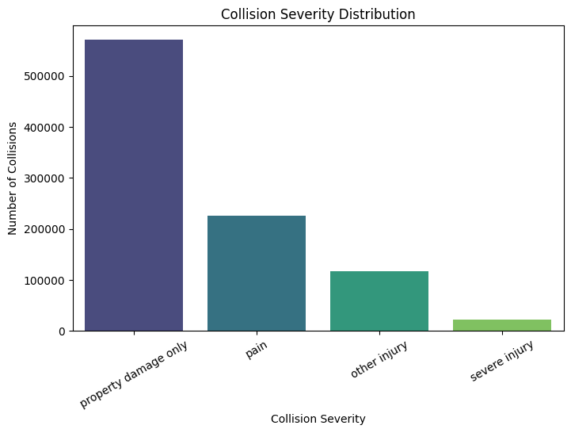 | 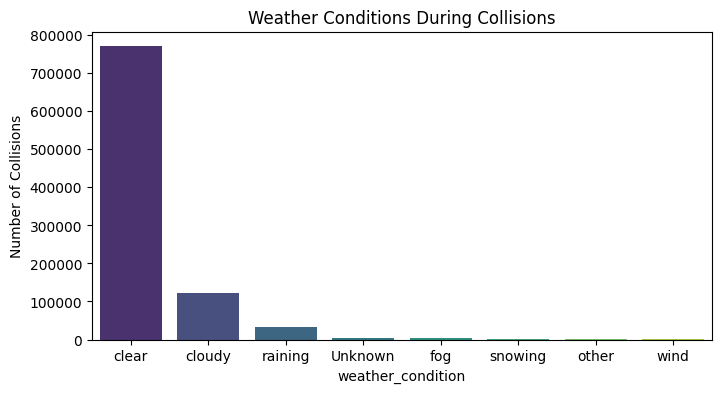 |
| 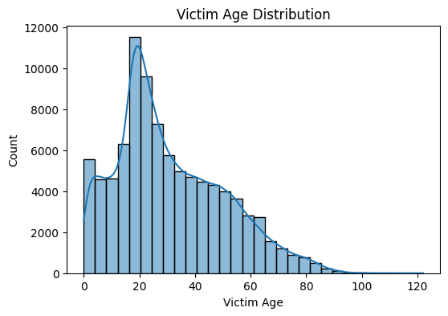 | 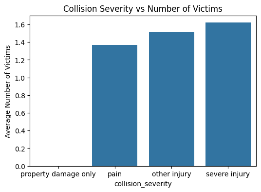 |
| 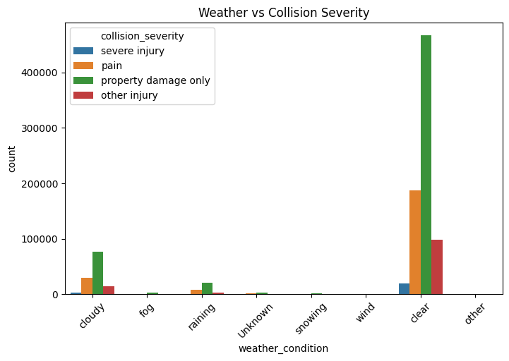 | 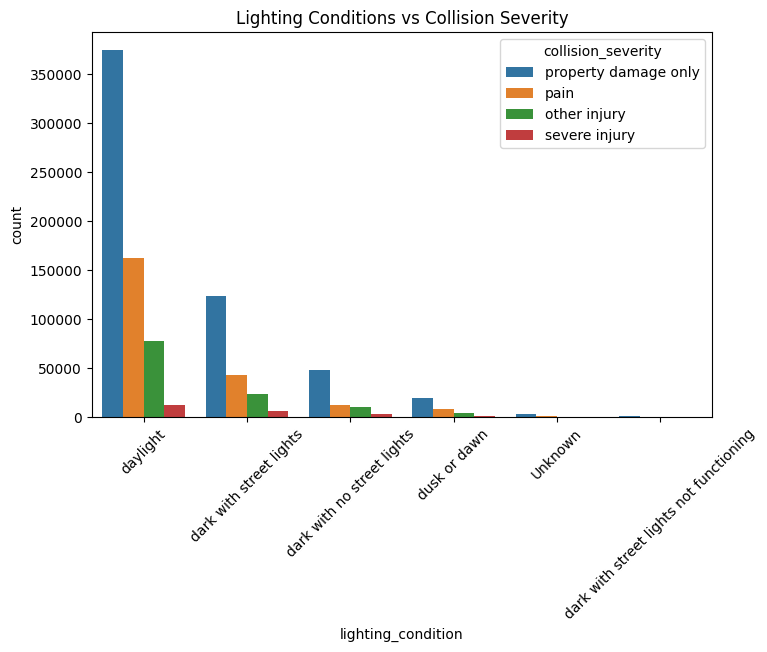 |
| 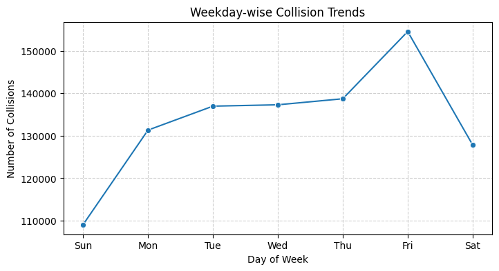 | 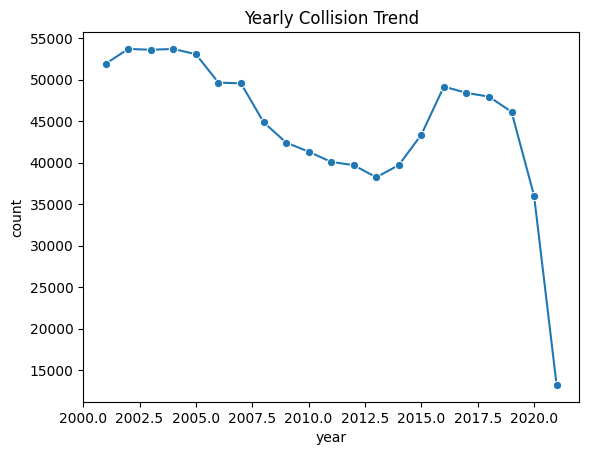 |
| 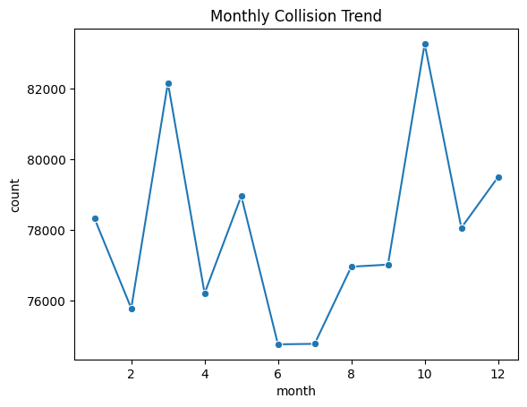 | 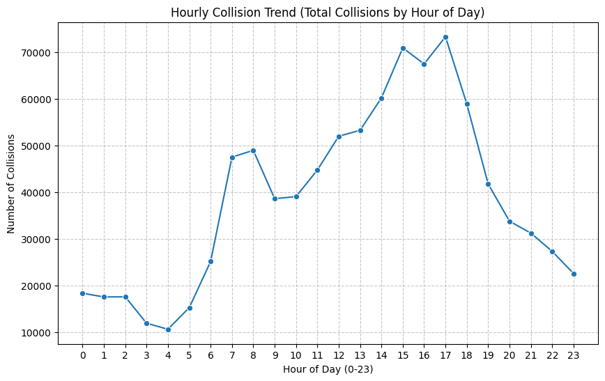 |
| 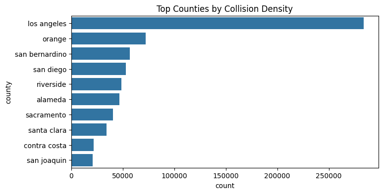 | 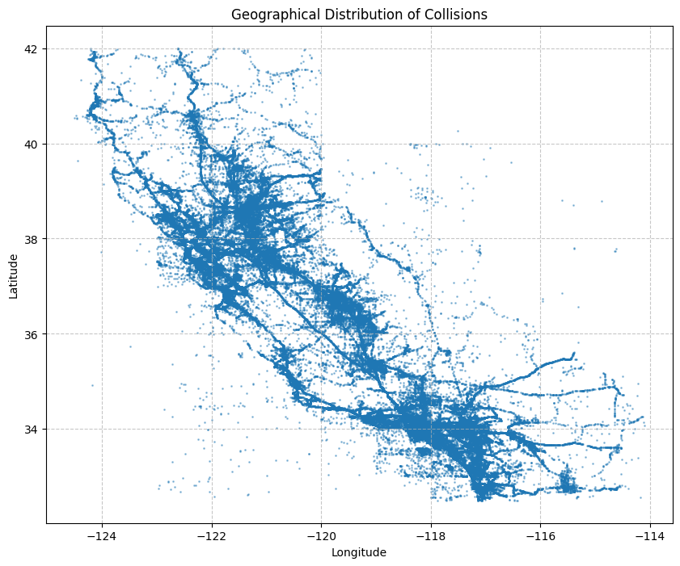 |

## Project Structure

```
california-traffic-collision-etl/
├── notebooks/
│   └── ETL_Traffic_Data_Analysis.ipynb
├── images/
│   ├── 01_collision_severity_distribution.png
│   ├── 02_weather_condition_distribution.png
│   ├── ...
│   └── 12_geographic_distribution.png
├── reports/
│   └── California_Traffic_Collision_Analysis_Report.docx
├── requirements.txt
├── .gitignore
├── LICENSE
└── README.md
```

## Getting Started

**1. Clone the repository**
```bash
git clone https://github.com/<your-username>/california-traffic-collision-etl.git
cd california-traffic-collision-etl
```

**2. Install dependencies**
```bash
pip install -r requirements.txt
```

**3. Add the dataset**
Place the SWITRS source CSVs (`sample_collisions.csv`, `sample_parties.csv`, `sample_victims.csv`, `sample_case_ids.csv`) in a `data/` directory, or update the `base_path` variable in the notebook to point to your data location. The [SWITRS dataset](https://tims.berkeley.edu/tools/switrs/) is publicly available in aggregate/statistical form via UC Berkeley SafeTREC's Transportation Injury Mapping System.

**4. Run the notebook**
Open `notebooks/ETL_Traffic_Data_Analysis.ipynb` in Jupyter, JupyterLab, or Google Colab and run all cells in order.

## Results & Business Intelligence Queries

| Business Question | Result |
|---|---|
| Top 5 counties by collision volume | Los Angeles (284,100), Orange (72,042), San Bernardino (56,737), San Diego (53,105), Riverside (48,686) |
| Month with highest collision volume | October — 83,274 collisions |
| Most common weather condition | Clear — 769,925 collisions |
| Most dangerous hour of day | 5:00 PM — 73,255 collisions |
| Top road surface conditions | Dry (845,635), Wet (76,833), Unknown (8,141), Snowy (4,121), Slippery (1,048) |
| Top 3 lighting conditions | Daylight (625,572), Dark w/ street lights (195,867), Dark w/o street lights (74,634) |

A full write-up with methodology, charts, and recommendations is available in [`reports/California_Traffic_Collision_Analysis_Report.docx`](reports/California_Traffic_Collision_Analysis_Report.docx).

## Known Issues

- The fatal-collision percentage query currently returns `0.000000%`, which is almost certainly a data-type or filter artifact (e.g. `killed_victims` not registering under the applied filter) rather than a true finding. This is flagged for follow-up rather than reported as valid — see the report's "Known Issues" note for details.
- The pipeline's markdown documentation originally referenced AWS S3 for storage, but the implemented pipeline uses Google Drive (Colab) and local CSV export — the README and report reflect the actual implementation.

## Future Work

- Correct the fatality-percentage calculation logic.
- Add driver-behavior (`primary_collision_factor`) analysis to quantify contributions of speeding, improper turns, and DUI to severe outcomes.
- Migrate storage from Google Drive to a cloud object store (e.g. AWS S3 or GCS) for production-scale deployment.
- Build an interactive Tableau/Power BI dashboard on top of the exported curated dataset.

## License

This project is licensed under the [MIT License](LICENSE).

---

**Author:** Nandita Verma
